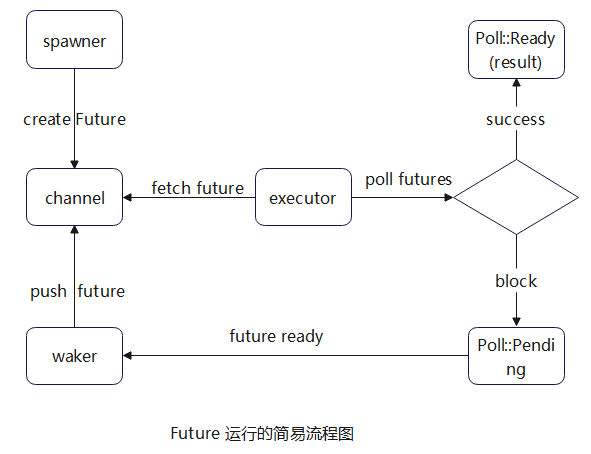

<style>
pre {
  overflow-y: auto;
  max-height: 300px;
}
</style>


# RUST FUTURES-Week1

## 参考文章

[200行代码讲透RUST FUTURES](https://stevenbai.top/rust/futures_explained_in_200_lines_of_rust/#%E8%BF%99%E6%9C%AC%E4%B9%A6%E6%B6%B5%E7%9B%96%E7%9A%84%E5%86%85%E5%AE%B9)

[RUST圣经](https://course.rs/advance/async/pin-unpin.html#%E5%B0%86%E5%9B%BA%E5%AE%9A%E4%BD%8F%E7%9A%84-future-%E5%8F%98%E4%B8%BA-unpin)


## 绿色线程(Green Threads)

### 代码

原文档的green threads可能因为版本问题已经不能编译通过了，这是修改后的：

```rust
use std::ptr;
use std::fmt;

const DEFAULT_STACK_SIZE: usize = 1024 * 1024 * 2;
const MAX_THREADS: usize = 4;
static mut RUNTIME: *mut Runtime = std::ptr::NonNull::dangling().as_ptr();

pub struct Runtime {
    threads: Vec<Thread>,
    current: usize,
}
impl std::fmt::Display for Runtime {
    fn fmt(&self, f: &mut std::fmt::Formatter<'_>) -> std::fmt::Result {
        write!(f, "Runtime {{ current: {} ;\n", self.current);
        for (index, my_struct) in self.threads.iter().enumerate() {
            write!(f, "  {}\n", my_struct)?;
        }
        write!(f, "}}")
    }
}
#[derive(PartialEq, Eq, Debug)]
enum State {
    Available,
    Running,
    Ready,
}
impl fmt::Display for State {
    fn fmt(&self, f: &mut fmt::Formatter<'_>) -> fmt::Result {
        match self {
            State::Available => write!(f, "Available"),
            State::Running => write!(f, "Running"),
            State::Ready => {
                write!(f, "Ready")
            }
        }
    }
}
struct Thread {
    id: usize,
    stack: Vec<u8>,
    ctx: ThreadContext,
    state: State,
    task: Option<Box<dyn Fn()>>,
}

#[derive(Debug, Default)]
#[repr(C)]
struct ThreadContext {
    rsp: u64,
    r15: u64,
    r14: u64,
    r13: u64,
    r12: u64,
    rbx: u64,
    rbp: u64,
    thread_ptr: u64,
}

impl Thread {
    fn new(id: usize) -> Self {
        Thread {
            id,
            stack: vec![0_u8; DEFAULT_STACK_SIZE],
            ctx: ThreadContext::default(),
            state: State::Available,
            task: None,
        }
    }
}
impl std::fmt::Display for Thread {
    fn fmt(&self, f: &mut std::fmt::Formatter<'_>) -> std::fmt::Result {
        write!(f, "Thread {{id: {},  state: {} ,  ctx: {:?}}}", self.id,  self.state, self.ctx)
    }
}
impl Runtime {
    #[allow(clippy::new_without_default)]
    pub fn new() -> Self {
        let base_thread = Thread {
            id: 0,
            stack: vec![0_u8; DEFAULT_STACK_SIZE],
            ctx: ThreadContext::default(),
            state: State::Running,
            task: None,
        };

        let mut threads = vec![base_thread];
        threads[0].ctx.thread_ptr = &threads[0] as *const Thread as u64;
        let mut available_threads: Vec<Thread> = (1..MAX_THREADS).map(Thread::new).collect();
        threads.append(&mut available_threads);

        Runtime {
            threads,
            current: 0,
        }
    }

    pub fn init(&mut self) {
        unsafe {
            let r_ptr: *mut Runtime = self;
            println!("RUNTIME has been initialized\n");
            RUNTIME = r_ptr;
        }
    }

    pub fn run(&mut self) -> ! {
        while self.t_yield() {}
        std::process::exit(0);
    }

    fn t_return(&mut self) {
        if self.current != 0 {
            self.threads[self.current].state = State::Available;
            self.t_yield();
        }
    }

    fn t_yield(&mut self) -> bool {
        let mut pos = self.current;

        while self.threads[pos].state != State::Ready {
            pos += 1;
            if pos == self.threads.len() {
                pos = 0;
            }
            if pos == self.current {
                return false;
            }
        }

        if self.threads[self.current].state != State::Available {
            println!("{}", &self);
            self.threads[self.current].state = State::Ready;
        }

        self.threads[pos].state = State::Running;
        let old_pos = self.current;
        self.current = pos;

        println!(
            "[current pos={pos} old_pos={old_pos} len={}] switch",
            self.threads.len()
        );
        println!(
            "old.ctx={:p} current.cxt={:p}",
            &self.threads[old_pos].ctx, &self.threads[pos].ctx
        );
        unsafe {
            __switch(&mut self.threads[old_pos].ctx, &self.threads[pos].ctx);
        }
        true
    }

    pub fn spawn<F: Fn() + 'static>(f: F) {
        unsafe {
            let rt_ptr = RUNTIME;
            let available = (*rt_ptr)
                .threads
                .iter_mut()
                .find(|t| t.state == State::Available)
                .expect("no available thread.");
            println!("spawn use RUNTIME to find available thread");
            
            let size = available.stack.len();
            let s_ptr = available.stack.as_mut_ptr();
            let s_ptr = s_ptr.add(size);
            let s_ptr = s_ptr as u64 & !0xf;
            let s_ptr = s_ptr as *mut u8;
            
            // 这俩都得对齐
            ptr::write_unaligned(s_ptr.sub(16).cast::<u64>(), guard as usize as u64);
            ptr::write_unaligned(s_ptr.sub(32) as *mut u64, __call as usize as u64);
            available.ctx.rsp = s_ptr.sub(32) as u64;
            println!("available.ctx.rsp = {:x}", available.ctx.rsp);

            available.task = Some(Box::new(f));
            available.ctx.thread_ptr = available as *const Thread as u64;
            available.state = State::Ready;
        }
    }
}

// 因为guard是对齐的，这里ret的时候rsp也得对齐
// 这个用rust好像做不了吧
fn call(thread: u64) {
    let thread = unsafe { &*(thread as *const Thread) };
    if let Some(f) = &thread.task {
        f();
    }
}

std::arch::global_asm!(
    ".globl __call",
    "__call:",
    //  fn call(thread: u64) {
    "   subq    $0x28, %rsp",
    "   movq    %rdi, 0x10(%rsp)",
    //  let thread = unsafe { &*(thread as *const Thread) };
    "   movq    %rdi, 0x18(%rsp)",
    //  if let Some(f) = &thread.task {
    "   movq    %rdi, %rax",
    "   addq    $0x60, %rax",
    "   movq    %rax, 0x8(%rsp)",
    "   movq    0x60(%rdi), %rdx",
    "   movl    $0x1, %eax",
    "   xorl    %ecx, %ecx",
    "   cmpq    $0x0, %rdx",
    "   cmoveq  %rcx, %rax",
    "   cmpq    $0x1, %rax",
    "   jne     0f",
    "   movq    0x8(%rsp), %rdi",
    //     if let Some(f) = &thread.task {
    "   movq    %rdi, 0x20(%rsp)",
    //         f();
    "   movq   8(%rdi), %rdi",
    "   callq   *0x28(%rdi)",
    // }
    "0: addq    $0x28, %rsp",

    // 没错，这里要再加一个8，这样retq使用的就是栈中的那个guard
    "   addq    $8, %rsp",
    "   retq",
    options(att_syntax)
);

fn guard() {
    unsafe {
        let rt_ptr = RUNTIME;
        let rt = &mut *rt_ptr;
        println!("THREAD {} FINISHED.", rt.threads[rt.current].id);
        rt.t_return();
    };
}

pub fn yield_thread() {
    unsafe {
        let rt_ptr = RUNTIME;
        (*rt_ptr).t_yield();
    };
}

std::arch::global_asm!(
    r#"
.globl __switch
__switch:
  mov  [rdi+0x00], rsp
  mov  [rdi+0x08], r15
  mov  [rdi+0x10], r14
  mov  [rdi+0x18], r13
  mov  [rdi+0x20], r12
  mov  [rdi+0x28], rbx
  mov  [rdi+0x30], rbp

  mov  rsp, [rsi+0x00]
  mov  r15, [rsi+0x08]
  mov  r14, [rsi+0x10]
  mov  r13, [rsi+0x18]
  mov  r12, [rsi+0x20]
  mov  rbx, [rsi+0x28]
  mov  rbp, [rsi+0x30]
  mov  rdi, [rsi+0x38]
  ret
"#
);

extern "C" {
    fn __switch(old: *mut ThreadContext, new: *const ThreadContext);
    fn __call(thread: u64);
}

#[cfg(not(windows))]
fn main() {
    let mut runtime = Runtime::new();
    runtime.init();
    Runtime::spawn(|| {
        println!("I haven't implemented a timer in this example.");
        yield_thread();
        println!("Finally, notice how the tasks are executed concurrently.");
    });
    Runtime::spawn(|| {
        println!("But we can still nest tasks...");
        Runtime::spawn(|| {
            println!("...like this!");
        })
    });
    runtime.run();
    println!("Hello, world!");
}
```
    


都是佬们写的，我只是个搬运工，之前有个`ctx`没对齐导致打印`ctx`时会出现`segment fault`，现已解决，大家可放心食用。

## 基于回调

基于回调的方法在编程中是一种常见的模式，尤其在处理异步操作时经常会用到。虽然在 JavaScript 中的回调地狱让人头痛，但在其他语言中，特别是像 Rust 这样的系统编程语言中，可以更好地管理回调。

在 Rust 中，基于回调的方法通常通过闭包来实现。闭包是一种可以捕获其周围环境并在稍后执行的匿名函数。下面是一个简单的例子，展示了如何在 Rust 中使用基于回调的方法：

```rust
use std::collections::HashMap;

// 定义一个保存回调函数的HashMap
// 键是字符串，值是一个闭包，它接受一个 i32 参数并返回一个 i32
// 这个闭包可以代表任何需要在以后执行的任务
let mut callbacks: HashMap<String, Box<dyn Fn(i32) -> i32>> = HashMap::new();

// 添加一个回调函数到 HashMap 中
callbacks.insert("double".to_string(), Box::new(|x| x * 2));

// 定义一个函数，它接受一个回调函数的名称和一个参数，然后调用相应的回调函数
fn call_callback(callback_name: &str, value: i32, callbacks: &HashMap<String, Box<dyn Fn(i32) -> i32>>) -> Option<i32> {
    if let Some(callback) = callbacks.get(callback_name) {
        Some(callback(value))
    } else {
        None
    }
}

// 调用回调函数
if let Some(result) = call_callback("double", 5, &callbacks) {
    println!("Result: {}", result); // 输出结果：10
}
```

在这个例子中，我们首先定义了一个 `HashMap`，它的键是字符串，值是一个接受 i32 参数并返回 i32 的闭包。然后，我们向 `HashMap` 中添加了一个回调函数，名称为 `"double"`，它将参数乘以 2。最后，我们定义了一个函数 `call_callback`，它接受回调函数的`名称`、`参数`和 `HashMap`，并调用相应的回调函数。通过这种方式，我们可以实现基于回调的方法。

## 关于闭包

### 闭包的基本语法

在Rust中，闭包的语法使用竖线 | | 来定义参数列表，箭头 -> 用于指定返回类型，大括号 { } 包含闭包的函数体。闭包的语法通常如下所示：

```rust
|param1, param2| -> ReturnType {
    // 闭包的函数体
    // 可以使用捕获的环境变量
}
```
### 闭包的三种形式

在Rust中，闭包可以写成三种形式，分别是：

1. `FnOnce`： 该闭包会获取它所捕获的变量的所有权（Ownership），并且只能被调用一次。通常用于消费被捕获变量的情况。

2. `FnMut`： 该闭包会获取它所捕获的变量的可变引用，并且可以被调用多次。通常用于修改被捕获变量的情况。

3. `Fn`： 该闭包会获取它所捕获的变量的不可变引用，并且可以被调用多次。通常用于不需要修改被捕获变量的情况。

### 闭包实例

闭包的捕获环境
闭包可以捕获其环境中的变量，这意味着闭包可以访问定义闭包时所在作用域中的变量。捕获的变量可以通过引用、可变引用或者所有权的方式进行访问。例如：

```javascript
let x = 10;
let add_x = |y| x + y;
println!("{}", add_x(5)); // 输出 15
```

在这个例子中，闭包 add_x 捕获了变量 x，并将其与参数 y 相加。闭包可以自动推断捕获变量的引用类型。

## 从回调到承诺 (promises)

promises 可视为一种状态机
Promises 有三种状态：`pending` （进行中）、`fulfilled` （已完成）和`rejected` （已拒绝）。一旦状态从 `pending`  转变为 `fulfilled`  或` rejected` ，它就会停留在该状态，并执行相应的处理程序。

承诺是解决回调带来的复杂性的一种方法。

`javascript` 回调

```javascript
setTimer(200, () => {
  setTimer(100, () => {
    setTimer(50, () => {
      console.log("I'm the last one");
    });
  });
});

```

`javascript` 承诺

```javascript
function timer(ms) {
    return new Promise((resolve) => setTimeout(resolve, ms))
}

timer(200)
.then(() => return timer(100))
.then(() => return timer(50))
.then(() => console.log('I'm the last one));

```

rust 中的 `Future` 和其它语言中的 `Promise` 类似，但它们是异步的。

## Future

[Future 流程](https://course.rs/advance/async/future-excuting.html#future-%E7%89%B9%E5%BE%81)

Future 是一种异步计算的结果，它代表了一个未来才会结束的计算。在 Rust 中，Future 是一种异步计算的抽象，它允许我们以一种统一的方式处理异步操作，而无需关心具体的实现细节。


### Future 流程


1. `Spawner` 方法用于生成 `Future` , 然后将它放入 __消息通道__ 中。
2. 执行器需要从 __消息通道( channel )__ 中拉取事件，然后运行它们。当一个任务准备好后（可以继续执行），它会将自己放入消息通道中，然后等待执行器 `poll` 。
3. 若在当前 `poll` 中， `Future` 可以被完成，则会返回 `Poll::Ready(result)` ，反之则返回 `Poll::Pending`， 并且安排一个 `wake` 函数：
4. 当未来 `Future` 准备好进一步执行时， 该函数会被调用，然后将该 `Future` 送入 __消息管道__ ，执行器从 __消息管道__ 拉取 `Future`, 再次调用 `poll` 方法，此时 `Future` 就可以继续执行了。(进入步骤2)




### 关于 `Pin` 和 `Unpin` 的理解

#### 官方内容：


将固定住的 `Future` 变为 `Unpin`
之前的章节我们有提到 `async` 函数返回的 `Future` 默认就是 `!Unpin` 的。

但是，在实际应用中，一些函数会要求它们处理的 `Future` 是 `Unpin` 的，此时，若你使用的 `Future` 是 `!Unpin` 的，必须要使用以下的方法先将 `Future` 进行固定:

`Box::pin`， 创建一个 `Pin<Box<T>>`
`pin_utils::pin_mut!`， 创建一个 `Pin<&mut T>`
固定后获得的 `Pin<Box<T>>` 和 `Pin<&mut T>` 既可以用于 `Future` ，又会自动实现 `Unpin`。

```rust
use pin_utils::pin_mut; // `pin_utils` 可以在crates.io中找到

// 函数的参数是一个`Future`，但是要求该`Future`实现`Unpin`
fn execute_unpin_future(x: impl Future<Output = ()> + Unpin) { /* ... */ }

let fut = async { /* ... */ };
// 下面代码报错: 默认情况下，`fut` 实现的是`!Unpin`，并没有实现`Unpin`
// execute_unpin_future(fut);

// 使用`Box`进行固定
let fut = async { /* ... */ };
let fut = Box::pin(fut);
execute_unpin_future(fut); // OK

// 使用`pin_mut!`进行固定
let fut = async { /* ... */ };
pin_mut!(fut);
execute_unpin_future(fut); // OK

```

#### 个人理解：

在这里，`Pin` 是一个包装着 __不可移动类型的指针__ ( eg: `Box`) 的类型 ，被 `Pin` 中指针包装的类型不能被移动， 但 `Pin` 的指针可以被移动和使用。


