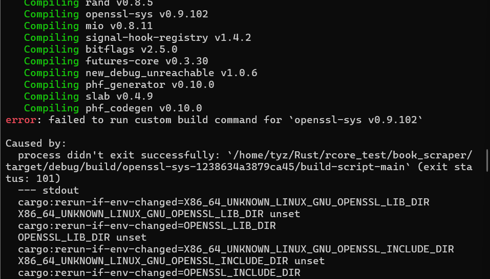

# some falut

## 参考文章

[为什么即使在本地安装后，rust 也无法为 openssl-sys v0.9.60 构建命令？](https://stackoverflow.com/questions/65553557/why-rust-is-failing-to-build-command-for-openssl-sys-v0-9-60-even-after-local-in)

[rust爬虫示例](https://youerning.top/post/rust/rust-simple-scraper/)

## rust爬虫时使用库时编译不成功

源码链接：[爬虫代码](./resource/crawler.rs)

依赖如下

```rust
[dependencies]
reqwest = "0.11.23"
scraper = "0.18.1"
tokio = { version = "1.35.1", features = ["full"] }
```

进行编译

```
cargo build
```

产生错误信息：


主要是`reqwest crate`的锅。

### 解决方案

在ubuntu下的解决方案（因为本人的是ubuntu，只能测试这个）：

```ubuntu
sudo apt install libssl-dev
```

其它系统下的解决方案或其它相关问题可以参考这个提问的相关解答：[为什么即使在本地安装后，rust 也无法为 openssl-sys v0.9.60 构建命令？](https://stackoverflow.com/questions/65553557/why-rust-is-failing-to-build-command-for-openssl-sys-v0-9-60-even-after-local-in)

