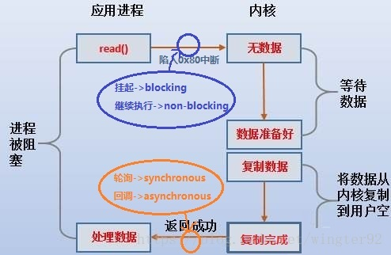
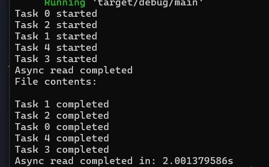

# week2

## 阅读文章：

[Embassy中文文档](https://lighklife.github.io/embassy-cn/index.html)

[基于rcore的串口异步驱动（还没运行好）](https://github.com/lighkLife/rCore-async)

[Async Rust vs RTOS 一决雌雄(原文在链接里面也有，挺有意思的)](https://github.com/lighkLife/new-blog/blob/main/Async%20Rust%20vs%20RTOS%20%E4%B8%80%E5%86%B3%E9%9B%8C%E9%9B%84.md)

这几个都是杨凯豪-lighkLife同学的github仓库的链接，感觉总结的很好，在这儿备个份。

## 异步、同步、阻塞、非阻塞
### 从Linux read()系统调用出发
无论是shell脚本编写者还是C语言开发者，在Linux平台上进行开发/运维工作肯定经常用read()这一方法，read()方法是linux的系统调用，在内核中真正处理它的是sys_read()方法，sys_read()是read系统调用的内核入口（详见[此博客](https://blog.csdn.net/lwj103862095/article/details/3851806)）。

那么用户进程在调用read()时发生了什么？如何区分这一调用是阻塞or非阻塞？又怎么区分用户进程与内核的通信是同步or异步？
下图：


图比较丑，但应该很清晰了。应用进程调用read()方法后，陷入0x80中断，此时如果用户进程挂起等待中断返回，说明这次调用时阻塞的；若马上继续执行后面的代码就是非阻塞的。在linux内核态中，数据需要从网络或者磁盘文件上读出并首先拷贝到内核的虚拟内存空间，然后再从内核的虚存空间拷贝到用户进程的虚存空间。在这一过程中，用户进程可能已经在执行数据处理的代码段，其有两种选择：

1）不断轮询内核数据是否已经完成（内核虚存空间->用户进程虚存空间）的拷贝过程；

2）直接开始处理数据或执行其它后续逻辑。

这里 `(1)` 就对应进程和内核之间的同步通信，`(2)` 则对应异步通信。多说一句，明显同步通信的代价很高，用户进程在轮询（例如while语句）内核，此时系统频繁地在用户态和内核态之间切换，上下文的开销是不容忽视的。当然，linux内核有”IO多路复用“这样的设计来优化这种轮询机制，但优化之后本质上还是同步轮询。

                        
以上内容摘自 [浅谈阻塞/非阻塞、同步/异步](https://blog.csdn.net/wingter92/article/details/80080737)

## 利用协程进行异步系统调用

那么如何利用协程进行异步系统调用呢？

利用协程（如Rust中的异步函数）实现异步系统调用，可以通过tokio这样的异步运行时库。以下是一个具体的示例，展示如何利用Rust的tokio库和异步编程模型，实现异步的文件读取操作，这是一种典型的异步系统调用。

### 环境设置
首先，在你的Cargo.toml文件中添加tokio依赖：
```rust
[dependencies]
tokio = { version = "1", features = ["full"] }
```
[通过协程进行异步调用](./resource/async.rs)

输出结果：

