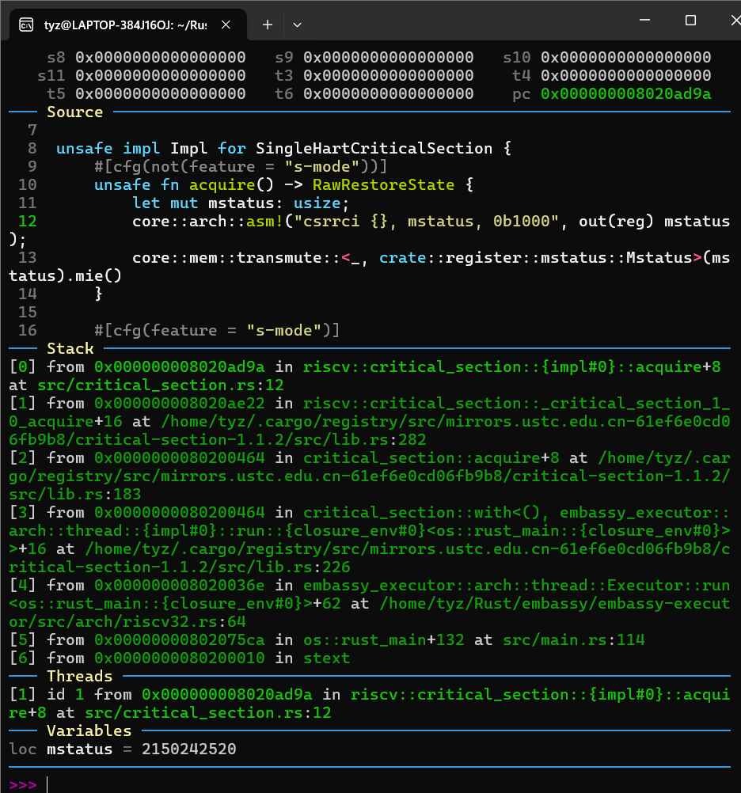
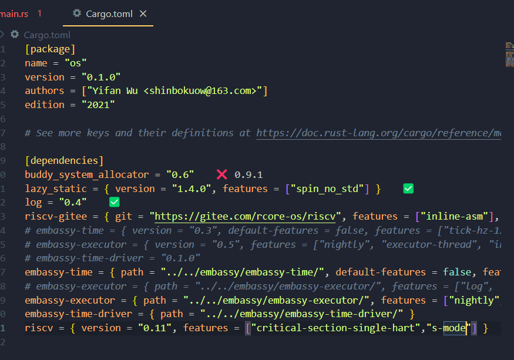

# some fault about s-mode 

## 故障阐述

在非`s-mode`模式下，在`embassy`的代码中的`poll`函数部分进入`critical_section::with()`函数，从而在`SingleHartCriticalSection`实现上进入了`#[cfg(not(feature ="s-mode"))]`模式下的代码，从而导致代码出错。

## 故障解决

在配置文件`Cargo.toml`中为 `riscv` 加上 `s-mode` 依赖特征。

