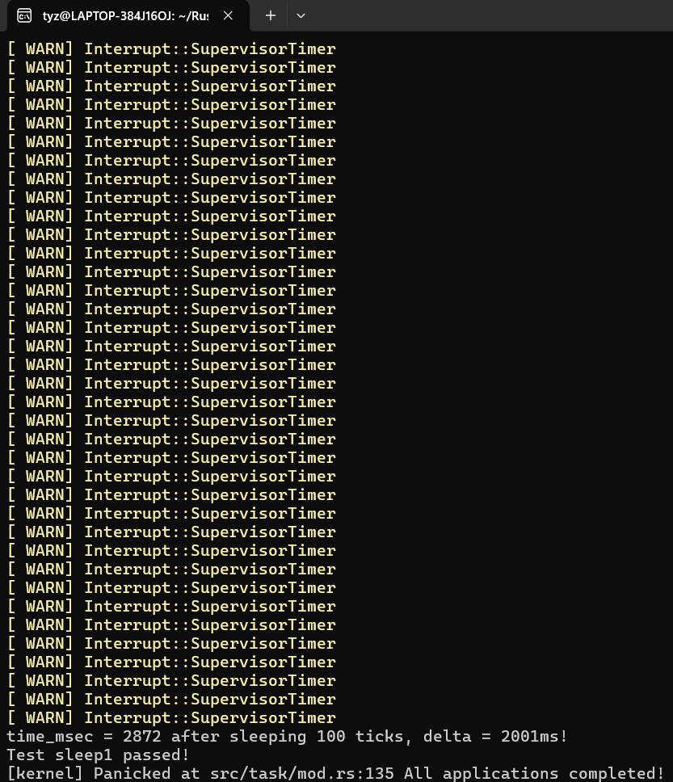
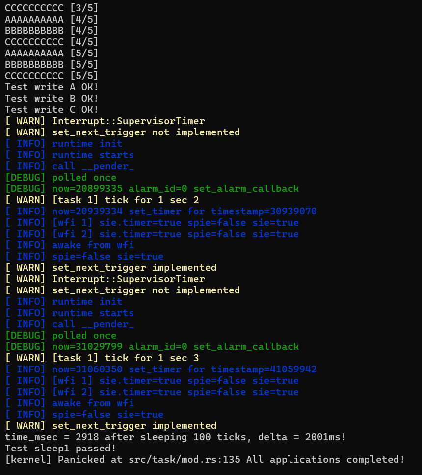

# 将embassy整合到rCore

## 添加依赖

在`Cargo.toml`中添加配置与依赖：

```toml
[package]
name = "os"
version = "0.1.0"
authors = ["Yifan Wu <shinbokuow@163.com>"]
edition = "2021"

# See more keys and their definitions at https://doc.rust-lang.org/cargo/reference/manifest.html

[dependencies]
buddy_system_allocator = "0.6"
lazy_static = { version = "1.4.0", features = ["spin_no_std"] }
log = "0.4"
riscv-gitee = { git = "https://gitee.com/rcore-os/riscv", features = ["inline-asm"], package = "riscv" }
# embassy-time = { version = "0.3", default-features = false, features = ["tick-hz-12_000_000"] } # 12_500_000 for qemu
# embassy-executor = { version = "0.5", features = ["nightly", "executor-thread", "integrated-timers", "arch-riscv32"] }
# embassy-time-driver = "0.1.0"
embassy-time = { path = "../../embassy/embassy-time/", default-features = false, features = ["tick-hz-10_000_000"] } # 12_500_000 for qemu
# embassy-executor = { path = "../../embassy/embassy-executor/", features = ["log", "nightly", "executor-thread", "integrated-timers", "arch-riscv32"] }
embassy-executor = { path = "../../embassy/embassy-executor/", features = ["nightly", "executor-thread", "integrated-timers"] }
embassy-time-driver = { path = "../../embassy/embassy-time-driver/" }
riscv = { version = "0.11", features = ["critical-section-single-hart"] }

```

## 添加代码


### 在 `src/timer.rs` 中实现时间驱动：

```rust

pub struct MyDriver {} // not public!

impl Driver for MyDriver {
    fn now(&self) -> u64 {
        riscv::register::time::read64()
    }
    unsafe fn allocate_alarm(&self) -> Option<AlarmHandle> {
        static ALARM: AtomicU8 = AtomicU8::new(0);
        Some(AlarmHandle::new(ALARM.fetch_add(1, Ordering::Relaxed)))
    }
    fn set_alarm_callback(&self, alarm: AlarmHandle, _callback: fn(*mut ()), _ctx: *mut ()) {
        debug!("now={} alarm_id={} set_alarm_callback", self.now(), alarm.id(),);
        // unsafe { riscv::register::sstatus::set_sie() };
        
    }
    fn set_alarm(&self, alarm: AlarmHandle, timestamp: u64) -> bool {
        let now = self.now();
        // debug!("now={now} timestamp={timestamp} alarm_id={} set_alarm", alarm.id());
        let set = now < timestamp;
        if set {
            info!("now={now} set_timer for timestamp={timestamp}");
            // set timer interrupt to wake up CPU from wfi
            set_timer(timestamp as usize);
            unsafe { riscv::register::sstatus::set_sie() };
        }
        set
        // false
    }
}
```
- 在 `set_alarm()` 函数中，我们调用 `set_timer()` 来设置定时器中断，并设置 `sstatus.sie` 使能中断。

- 在 `set_alarm_callback()` 函数中，我们记录和打印当前时间戳与警告id


```rust
#[no_mangle]
fn __pender(_ctx: *mut ()) {
    info!("call __pender_");
}
```


### 在 `src/time.rs` 中重写定时器代码：

- 将 `set_timer()` 用 `embassy` 框架重写

```rust
/// Set the next timer interrupt
pub fn set_next_trigger() {
    warn!("set_next_trigger not implemented");
    embassy_runtime();
    warn!("set_next_trigger implemented");

    // set_timer(get_time() + CLOCK_FREQ / TICKS_PER_SEC);
}
```

- 在 `embassy_runtime()` 中实现 `embassy` 框架的具体逻辑，这里有一点很值得探讨！就是在 `embassy_runtime()` 中未执行完的任务会保存当前任务进度与状态并等待下一次调用后继续先前的逻辑执行，这为我们实现异步驱动提供了很大的便利。
``` rust
fn embassy_runtime() {
    static mut S : usize = 0;
    embassy_time_driver::time_driver_impl!(static DRIVER: MyDriver = MyDriver{});
    unsafe { S = S + 1;}
    static mut RUNTIME: Option<Executor> = None;
    let runtime = unsafe { RUNTIME.get_or_insert_with(|| Executor::new(&mut ())) };
    info!("runtime init");
    let spawner = runtime.spawner();
    info!("runtime starts");
    spawner.spawn(run1(1, || warn!("[task 1] tick for 1 sec {}", unsafe {S}))).unwrap();
    for _ in 0..1 {
        debug!("polled once");
        unsafe { runtime.poll() };
        let sstatus = riscv::register::sstatus::read();
        let timer = riscv::register::sie::read().stimer();
        info!("[wfi 1] sie.timer={timer} spie={} sie={}", sstatus.spie(), sstatus.sie());
        // unsafe { core::arch::asm!("wfi") };
        let sstatus = riscv::register::sstatus::read();
        let timer = riscv::register::sie::read().stimer();
        info!("[wfi 2] sie.timer={timer} spie={} sie={}", sstatus.spie(), sstatus.sie());
        info!("awake from wfi");
    }
    let sstatus = riscv::register::sstatus::read();
    info!("spie={} sie={}", sstatus.spie(), sstatus.sie());
    // board::exit_success();
}

#[embassy_executor::task(pool_size=2)]
async fn run1(sec: u64, f: fn()) {
    embassy_time::Timer::after_secs(sec).await;
    f();
}

```

### 在 `src/main.rs` 中为 `task::run_first_task()` 添加embassy异步架构代码：


```rust
fn embassy_runtime1() {
    use core::sync::atomic::{AtomicU8, Ordering};
    use embassy_executor::raw::Executor;
    use embassy_time_driver::{AlarmHandle, Driver};

    static mut RUNTIME: Option<Executor> = None;
    let runtime = unsafe { RUNTIME.get_or_insert_with(|| Executor::new(&mut ())) };
    info!("runtime init");
    let spawner = runtime.spawner();
    info!("runtime starts");
    spawner.spawn(run(2, || task::run_first_task())).unwrap();
    unsafe { runtime.poll()};
    let sstatus = riscv::register::sstatus::read();
    info!("spie={} sie={}", sstatus.spie(), sstatus.sie());
    // board::exit_success();
}

#[embassy_executor::task]
async fn run(sec: u64, f: fn()) {
    loop {
        // embassy_time::Timer::after_secs(sec).await;
        f();
        // info!("tick for 1 sec");
    }
}
```


## 运行结果
在未加入 `embassy` 框架时，我们使用 `set_timer()` 函数来设置定时器中断，并设置 `sstatus.sie` 使能中断。这样在最后一段等待 `user` 中的 `sleep1` 执行完毕的过程中，会一直触发 `Interrupt::SupervisorTimer` 中断。



在加入 `embassy` 框架后，我们使用 `embassy_time_driver::Timer::after_secs()` 来设置定时器中断，并设置 `sstatus.sie` 使能中断。这时定时器中断会在 `embassy_runtime()` 函数中触发，而且会异步等待  `user` 中的 `sleep1` 执行。不会一直触发 `Interrupt::SupervisorTimer` , 大大降低了cpu的功耗。



## 代码链接
[将embassy整合到rCore——关于定时器的重构](https://gitee.com/ZIP97/rCore-tutorial-code-2024S-embassy)